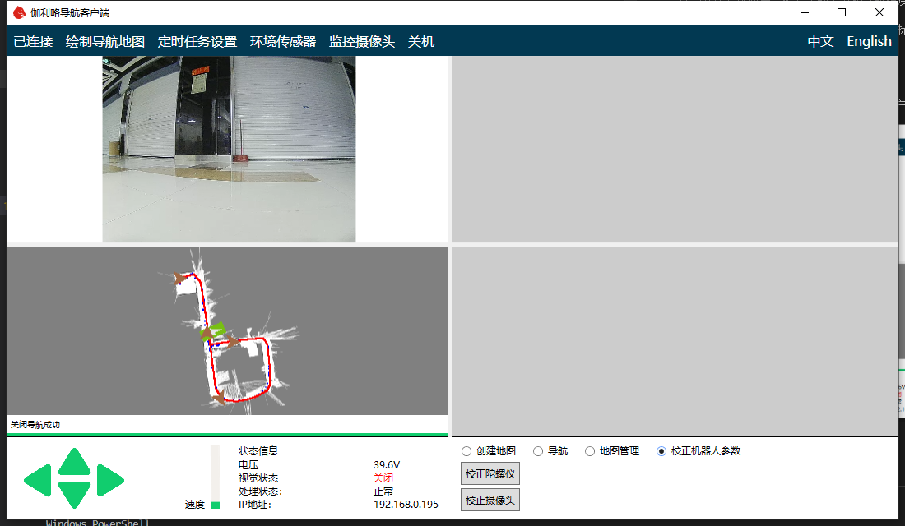
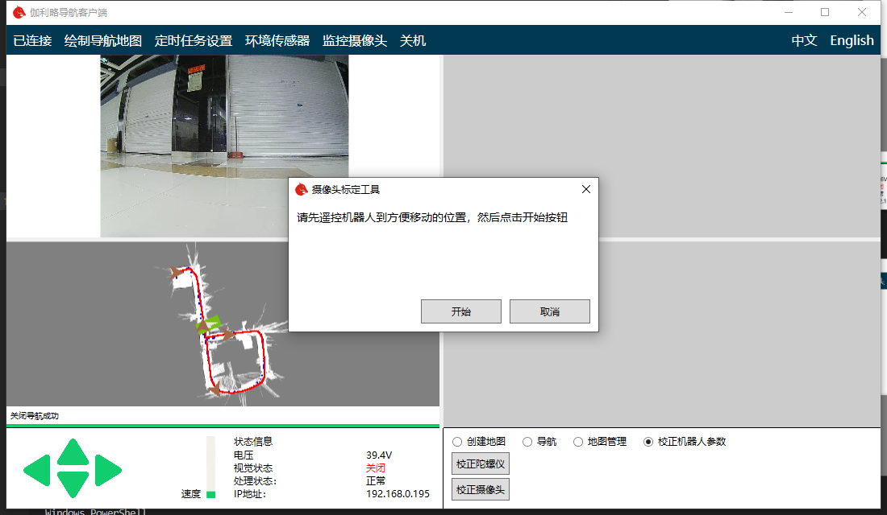
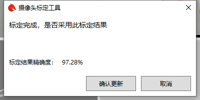

# 机器人标定

在使用机器人的过程中，由于机器人组装时的误差。会导致程序内置参数和机器人实际参数存在误差，从而影响到机器人的定位和导航的精度。使用机器人标定工具可以对机器人参数进行标定，降低这部分误差从而提高机器人的定位和导航精度。

机器人的标定包含两个部分。一个是陀螺仪标定，一个是摄像头参数标定。

演示视频

<video src="https://bwbot.org/s/sHt8wN" controls style="max-width: 100%"></video>

## 陀螺仪标定

陀螺仪是机器人用来短距离定位的设备。相当于人类的小脑。首先打开客户端，连接机器人。

点击右下角的校正机器人参数

接着点击校正陀螺仪

弹出标定陀螺仪窗口。此时窗口中会显示陀螺仪数据。此数值越小则说明机器人陀螺仪越准确。

点击开始标定即可标定。注意在标定过程中千万不能触碰机器人。这样会导致标定产生很大误差。整个标定过程可能需要两分钟。请耐心等待。

标定完成后即可关闭陀螺仪标定窗口。

## 摄像头标定

摄像头标定过程需要遥控机器人在环境中导出走动，所以在开始标定之前请保证能够有足够的空间供机器人移动。

点击右下角的校正摄像头按钮。弹出摄像头校正窗口。

根据提示，遥控机器人到较开阔的位置。然后点击开始按钮。

此时机器人会进入建图状态。

按照窗口提示，移动机器人形成一个闭环。

等待闭环完成，形成闭环后继续遥控机器人前进一段距离。此时机器人会自动计算出标定参数，和误差。

比较好的结果可以达到99%以上。你可以根据准确度决定是否接受标定结果。如果接受结果，点击确认更新按钮即可。

至此标定完成。
