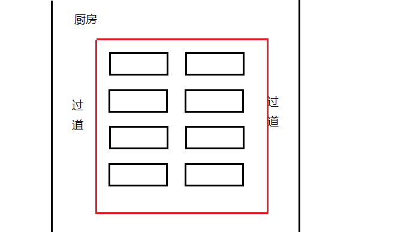

# 第3章 视觉导航

## 3.1 系统介绍

导航系统工作流程:

(1)、在图传遥控模式下，操作人员遥控设备环绕运动区域两周，建立机器人可以理解的视觉地图。

(2)、利用控制软件在步骤1中建立的视觉导航地图上手工规划绘制机器人导航路线、设置目标点。

(3)、制定路径和目标点后，启动导航服务，选择目标点后机器人开始沿着步骤2中规划的轨迹自主移动，自动的向目标点移动。

## 3.2 地图的建立

根据第二章的操作打开遥控图传后，设置底盘移动速度为20%左右，点击主界面上的“开始建图”按钮，等待程序启动。

打开视觉系统输出画面

遥控机器人向前直线运动，直到视觉系统初始化成功

现在视觉系统已经启动完成、开始遥控机器人在运动区域移动，遥控过程中尽量避免纯转动（只按左转或右转，这容易使视觉系统丢失目标），请按住前进键的同时按左转或右转键，使机器人沿大半径轨迹转弯。

遥控过程中，请确保主界面中的视觉指示状态为`“追踪中”`，一旦变成红色的`“丢失”`，请遥控机器人回退到上一段正常状态的地方，回退过程必须使用后退按键，保证机器人朝向、视角不变。

遥控过程中视觉指示状态如果出现`“闭环优化中”`,请暂时不要操作机器人。当机器人走过的路径形成了一个圈时，机器人会自动的优化之前建立的地图，这样会极大的提高地图质量。因此在建图过程中可以遥控机器人多次走闭合的路径，这样会建立出更加精确的地图。建图的质量会极大的影响之后导航的效果。

一般比较好的建图方式，以下面的餐厅布局为例

两侧为过道，中间是桌子。我们可以遥控机器人按照红色路线首先顺时针转一圈。在客户端提示闭环优化完成之后再逆时针转一圈。同样也需要闭环优化完成。这样就能获取到比较好的建图效果。

注意建图的质量会极大的影响之后导航的效果。

当机器人已经浏览整个运动区域后，停止移动，点击主界面上的“保存地图”按钮，等待弹出保存对话框。在对话框中输入地图名称，然后点击确定。等待地图载入完成。

地图载入完成后可以看到刚才建立地图的大致效果。如果感觉比较满意可以点击结束建图按钮。这样建图部分就完成了。

本节完整演示视频：

[视觉地图的建立过程](https://www.bwbot.org/s/H3B6xC)

## 3.3 导航轨迹绘制和目标点设置

`Warning：因为轨迹规划需要下载、渲染视觉地图，客户端和机器人要交换大量数据，整个过程需要较长时间。下述各步骤的执行，请耐心等待客户端软件界面的更新。`

打开控制端软件，点击“未连接”按钮与底盘建立连接，点击主界面上的“绘制导航地图”按钮打开导航路径编辑界面。

加载成功后，软件界面类似下图

### 3.3.a 绘制导航轨迹

导航轨迹就是你想要机器人行走的路径。点击主界面上的“开始导航”后，机器人就会按照你画的路径进行移动。下面介绍一下路径绘图工具的使用方法。

-  1. 基本操作

  基本操作包括平移和缩放。鼠标左键拖动地图可以实现地图的平移。鼠标滚轴前后滚动可以实现地图的缩放，这在绘制路径的过程中非常的有用。对于对运动要求比较细致的地方可以放大后进行绘图。
-  2. 铅笔工具

  点击左侧工具栏里的铅笔一样的图标。这就是直线工具。鼠标左键点击图上任意一点，然后移动鼠标就会出现一条红色直线。移动鼠标到想要的终止位置，再次点击鼠标左键，一条直线就绘制完成了。如果想要画折线可以在转折点连续点击两次。
-  3. 橡皮擦工具

  点击左侧工具栏中的橡皮擦工具，然后按下鼠标左键进行拖动就可以擦除之前绘制的点。橡皮擦的擦出范围很小，删除操作推荐使用下面的删除工具。
-  4. 曲线工具

  点击左侧曲线工具，在曲线的起始点点击鼠标左键，然后在曲线的中间的再次点击一次鼠标左键，最后在曲线的结束点点击鼠标左键。这样一条曲线就绘制完成了。
-  5. 删除工具

  如果想要大范围的删除之前绘制的点，那么就可以利用这个删除工具。点击左侧的删除工具然后鼠标左键点击删除的起始点，可以看到在鼠标的移动过程中有一个矩形一直在跟随。再次点击鼠标左键就可以删除矩形选中的范围。

利用这几个工具就可以绘制出机器人的导航路线了。注意要尽量沿着原有的轨迹进行来画线（蓝点），这样可以保证在运动过程中路线是畅通的。从绿色的地图点可以大致看出地形，根据这些信息画出运动所范围允许的点。对于服务机器人模式轨迹是连通的就可以了。

### 3.3.b 设置目标点

对于服务机器人的应用场景。机器人需要在几个固定的位置间来回走动。比如从厨房走至一号桌，然后返回厨房走向二号桌等等。下面的工作就是在上面绘制的路线上标出各个目标点的位置。之后我们可以通过发送对应的目标点给机器人，然后让机器人自动的走到目标点。

点击激活导航目标点插入工具，在导航路线上依次点击插入导航目标点。同样可以利用橡皮擦和删除工具来删除导航目标点。

在下方的当前选中的导航点中输入对应的目标点序号，对应的目标点会在图中显示绿色。通过这种方式我们可以知道每个目标点的序号。`注意在送餐机器人模式中0号点对应着后厨位置。`

### 3.3.c 保存上传导航路线

点击界面上的“保存路径”按钮，输入文件名，点击“保存”即可。

本节完整演示视频：

[绘制规划路径和目标点](https://www.bwbot.org/s/pY3uAg)

## 3.4 导航服务的开启与关闭

打开控制端软件，点击“未连接”按钮与底盘建立连接。等待地图下载完成，客户端自动加载上几节绘制的导航地图和路径站点。

`将机器人遥控到能够追踪的位置，机器人必须在导航路线上，且机器人朝向必须和建图时的朝向一致。`

点击“开始导航”按钮即开始导航服务，程序载入完成机器人开始自主移动，同时界面中指示机器人位置的蓝色块开始同步更新。

如果想停止导航服务，直接点击“停止服务”按钮。

如果导航过程中，机器人突然停止运动，视觉状态变成了“丢失”，这说明视觉系统丢失目标，导致的原因可能是这两个：(1)、机器人初始运动方向和地图建立时的运动方向相反，(2)、光照强度或者环境发生了巨大变化。对于原因(1)请将机器人掉头后重新开始，对于原因(2)需要重新建立地图和规划路径。

本节完整演示视频：

[机器人导航服务的启动与关闭](https://www.bwbot.org/s/fBYkCv)

`紧急无法控制情况下，请手动按 下车盘上的红色开关，使小车急停`

## 3.5 地图的管理与更新

在地图管理控制面板我们提供了地图的管理功能，包括地图的删除，更新和另存为。

### 3.5.1 更新地图

在实际的使用中，可能环境变化比较大，导致以前建的地图无法再继续追踪。这时候可以使用更新地图功能。首先在左侧菜单选择要更新的地图，点击更新地图按钮。

开启更新之后可能机器人无法追踪。这时候可以遥控机器人到环境变化不大的地方，使得机器人可以追踪环境。之后的操作和建图的过程一样。当更新完成后，首先点击另存为。然后输入新地图的名称等待保存完成。如果觉得新地图的质量不错，那么可以点击结束更新，停止地图更新程序。在地图下拉菜单中可以看到新更新的地图。之后就可以用新地图去导航了。

### 3.5.2 删除地图

在第一个下拉菜单中选择地图名称。点击右侧的删除按钮即可删除地图。

[机器人地图管理](https://www.bwbot.org/s/TPuSCo)
