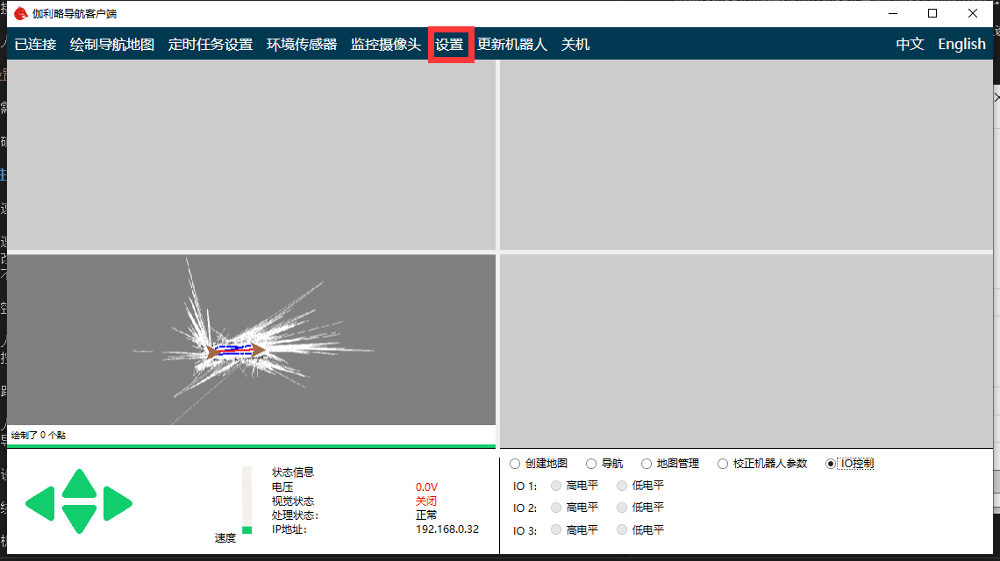

# 机器人参数修改

对应于不同的应用环境所需要的机器人的表现会有差别。比如有的场景需要机器人运动快一些，有的场景却需要机器人运动的更加平稳一些。机器人的表现都是由对应的参数确定的。通过机器人参数修改界面，我们可以轻松的修改机器人的参数从而让机器人更加适应我们的应用场景。

在连接机器人后点击上方导航栏中的设置按钮，打开机器人设置界面。

如果导航栏并没有设置按钮则说明机器人不支持设置参数。可以在更新机器人程序后再次尝试。

机器人设置界面如下

修改需要改动的参数然后点击确认即可更新机器人参数。

如果确认按钮为禁用状态说明机器人程序不支持参数修改功能，需要升级机器人程序后再次修改。

## 主要参数说明

导航速度

导航速度为机器人导航时的目标速度，同时也是最大速度。如果导航速度相对于默认值变化不大可以直接修改。如果有比较大的变动则需要同时修改下面的几个PID控制参数。否则机器人可能会出现导航时摇摆不定，无法稳定导航的问题。

PID控制参数

机器人运动控制采用PID算法，K2, Kp, Ki, Kd即为相关的控制参数。如果你的PID控制算法比较熟悉可以按照一般的PID参数校调方法进行调整。如果不熟悉最好不要进行修改。

预估距离

机器人进行运动估算时的距离范围。距离越大估算范围越大，结果更加准确，但是同时会导致计算时间增加导致估算延时增加。一般不建议修改。

避障设置

是否绕开

控制机器人在遇到障碍物时是原地等待还是自主绕开避障。

避障距离

在设置机器人遇到障碍物原地等待的情况下，控制机器人离障碍物多远时停下。

地图设置

机器人的默认导航地图和对应的导航路径设置。在开启自动切换地图的功能时，机器人会按照此处的设置自动载入相关地图对应的路径。可以用于实现机器人自动导航场景切换，如从一号仓库自动切换到二号仓库。从一层场景自动切换到二层场景。
